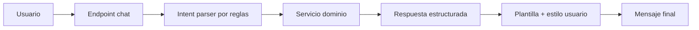

# Chatbot Sin LLM Para OketaCup

Guia de desarrollo para construir un chatbot que responda SOLO con datos reales de la aplicacion (partidos, resultados, puntos, clasificaciones), sin usar modelos LLM.

Objetivos:

- Cero alucinaciones: solo respuestas basadas en base de datos.
- Respuestas personalizadas por usuario (frases hechas, tono, estilo).
- Coste operativo muy bajo.
- Implementacion incremental compatible con el stack actual (Django + PostgreSQL + templates).

---

## 1. Vision funcional

El chatbot debe poder responder, como minimo, a:

- Proximos partidos (por fecha, fase, equipo).
- Resultados de partidos ya finalizados.
- Clasificacion por grupos.
- Puntuacion de participantes (ranking de la bolilla).
- Estado de eliminatorias (quien pasa, cruces, bracket).

Fuera de alcance (v1):

- Preguntas abiertas tipo conversacion general.
- Opiniones, predicciones no basadas en reglas, narrativa libre.
- Integraciones externas (WhatsApp/Telegram) en primera fase.

---

## 2. Arquitectura propuesta (sin LLM)

Componentes:

1. Capa de entrada (chat endpoint):
- Recibe mensaje del usuario.
- Identifica usuario autenticado.

2. NLU basado en reglas (intent parser):
- Detecta intencion con patrones/palabras clave.
- Extrae entidades simples: fecha, grupo, fase, equipo.

3. Motor de consulta (query services):
- Llama servicios de dominio existentes o nuevos.
- Devuelve datos estructurados y validados.

4. Motor de respuesta (template renderer):
- Selecciona plantilla segun intencion y resultado.
- Aplica estilo por usuario (tono/frases hechas).

5. Auditoria y trazabilidad:
- Guarda interaccion: input, intent detectado, respuesta emitida, tiempo.

Flujo:



---

## 3. Tecnologias recomendadas

Base (ya en el proyecto):

- Django (views/API)
- PostgreSQL (datos y logs de chat)
- DRF (si quieres endpoint REST para frontend moderno)
- pytest para pruebas

Para parser de texto sin LLM:

- `re` (regex) + diccionarios de sinonimos (suficiente en v1)
- opcional v2: `rapidfuzz` para matching tolerante de equipos/fases

Para tiempo/fechas:

- `datetime` + `zoneinfo` (Python stdlib)
- soporte de formatos de fecha en castellano (hoy, manana, 24/06, etc.)

Frontend:

- UI sencilla en template Django (widget de chat en pagina)
- peticiones fetch a endpoint interno

No necesario en v1:

- Redis
- Celery
- Vector DB
- Proveedores LLM

---

## 4. Modelo de datos recomendado

Nuevos modelos sugeridos (app nueva `apps/chatbot` o dentro de `apps/pool`):

1. `ChatProfile`
- `user` (OneToOne con User)
- `tone` (formal, cercano, bromista, corto)
- `catchphrase_opening` (frase de apertura)
- `catchphrase_closing` (frase de cierre)
- `verbosity` (short, normal)
- `use_emojis` (bool)

2. `ChatInteraction`
- `user`
- `input_text`
- `intent`
- `entities_json`
- `response_text`
- `status` (ok, fallback, error)
- `created_at`
- `latency_ms`

3. `ChatIntentPattern` (opcional si quieres configurable sin deploy)
- `intent`
- `pattern`
- `priority`
- `enabled`

---

## 5. Intenciones base (MVP)

Propuesta de intents iniciales:

- `NEXT_MATCHES`
- `MATCH_RESULT`
- `GROUP_TABLE`
- `USER_POINTS`
- `GLOBAL_RANKING`
- `KNOCKOUT_STATUS`
- `HELP`
- `UNKNOWN`

Ejemplos de disparadores:

- NEXT_MATCHES: "proximos", "que partidos hay", "hoy", "manana"
- MATCH_RESULT: "resultado", "como quedo", "marcador"
- GROUP_TABLE: "clasificacion grupo", "tabla grupo"
- USER_POINTS: "mis puntos", "cuantos puntos llevo"
- GLOBAL_RANKING: "ranking", "clasificacion general"
- KNOCKOUT_STATUS: "eliminatorias", "bracket", "cruces"

---

## 6. Respuestas personalizadas por usuario

Sin LLM, la personalizacion funciona muy bien por plantillas.

Ejemplo de plantilla base (`GLOBAL_RANKING`):

- Apertura segun perfil
- Bloque de datos
- Cierre segun perfil

Plantilla conceptual:

```text
{opening}
Top {n} ahora mismo:
1) {name1} - {pts1} pts
2) {name2} - {pts2} pts
3) {name3} - {pts3} pts
{closing}
```

Perfiles ejemplo:

- Formal: opening="Resumen actualizado.", closing="Si quieres, te amplio detalles."
- Cercano: opening="Vamos al lio:", closing="Te saco mas datos si quieres."
- Bromista: opening="Atencion al salseo:", closing="Esto se pone calentito."

Importante:

- El contenido de datos no cambia por estilo.
- Solo cambia la presentacion.

---

## 7. Seguridad y limites

Reglas clave:

- Solo responder intents permitidos.
- No ejecutar SQL libre desde texto del usuario.
- No exponer datos privados de otros usuarios (por ejemplo, picks privados) si no corresponde.
- Limitar longitud de entrada y frecuencia (rate limit basico por usuario/IP).
- Fallback consistente: "No he entendido la consulta. Prueba con...".

---

## 8. Integracion en el codigo actual

Encaje propuesto:

1. Crear app nueva: `apps/chatbot`
2. Añadir:
- `services/intents.py`
- `services/extractors.py`
- `services/reply_builder.py`
- `services/query_service.py`

3. Endpoint:
- `POST /chatbot/query` (DRF o Django view)

4. Reutilizar logica existente:
- modelos `Match`, `NationalTeam`
- calculo de puntuaciones/ranking desde `apps/pool/services/scoring.py`

5. UI:
- bloque en dashboard con input + historial corto

---

## 9. Roadmap por fases

### Fase 0 (1-2 dias): discovery tecnico

- Definir intents finales de v1.
- Definir datos exactos que puede mostrar cada intent.
- Diseñar contrato de respuesta JSON interno.

Entregable:

- Documento corto de contrato de intents + entidades.

### Fase 1 (3-5 dias): MVP backend sin personalizacion

- Parser por reglas para 4 intents:
  - NEXT_MATCHES
  - MATCH_RESULT
  - USER_POINTS
  - GLOBAL_RANKING
- Endpoint funcional.
- Fallback `UNKNOWN`.
- Tests unitarios parser + servicio.

Entregable:

- Endpoint en verde con pytest.

### Fase 2 (2-3 dias): personalizacion por usuario

- Modelo `ChatProfile`.
- Plantillas con `opening/closing` por perfil.
- Pantalla simple para editar tono/frases (admin o perfil usuario).

Entregable:

- Respuesta distinta por usuario con mismos datos.

### Fase 3 (2-4 dias): cobertura funcional ampliada

- Añadir intents:
  - GROUP_TABLE
  - KNOCKOUT_STATUS
  - HELP
- Mejorar parser de fechas (hoy/manana/fecha concreta).
- Añadir trazas en `ChatInteraction`.

Entregable:

- v1 completa sin LLM para uso real.

### Fase 4 (opcional): UX y robustez

- Widget chat mejorado (historial, botones sugeridos).
- Rate limit basico.
- Dashboard de metricas (intents mas usados, fallos UNKNOWN).

---

## 10. Estimacion de coste

Desarrollo inicial (sin LLM):

- Bajo-medio
- Aproximadamente 2-3 semanas a ritmo parcial

Coste operativo:

- Muy bajo
- Basicamente infraestructura actual (Django + DB)

Mantenimiento:

- Bajo al principio
- Crece segun numero de intents y variantes de lenguaje

---

## 11. Riesgos y mitigaciones

Riesgo: parser por reglas no entiende lenguaje muy libre.

Mitigacion:

- Empezar con intents claros y ejemplos guiados en UI.
- Añadir sinonimos y patrones iterativamente usando logs reales.

Riesgo: respuestas inconsistentes por cambios en datos.

Mitigacion:

- Centralizar consultas en un `query_service`.
- Tests de regresion por intent.

Riesgo: sobrepersonalizacion dificil de mantener.

Mitigacion:

- Limitar estilos a un set pequeno (3-4 tonos).
- Mantener plantillas versionadas.

---

## 12. Criterios de exito (KPIs)

- >= 80% de consultas entran en intent conocido (no `UNKNOWN`) en 2 semanas.
- Tiempo medio de respuesta < 700 ms en entorno productivo.
- 0 respuestas con datos inventados (por diseno).
- Satisfaccion de usuario (encuesta simple) >= 4/5.

---

## 13. Siguiente paso recomendado

Implementar Fase 1 con un alcance muy controlado:

1. `NEXT_MATCHES`
2. `USER_POINTS`
3. `GLOBAL_RANKING`

y una UI minima con ejemplos clickables, para recoger lenguaje real de usuarios antes de ampliar intents.
